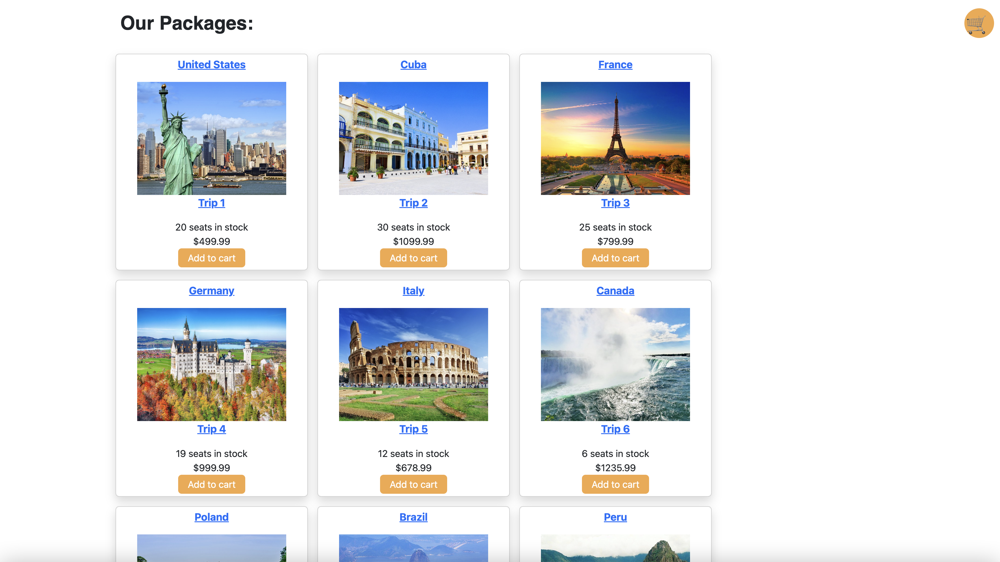
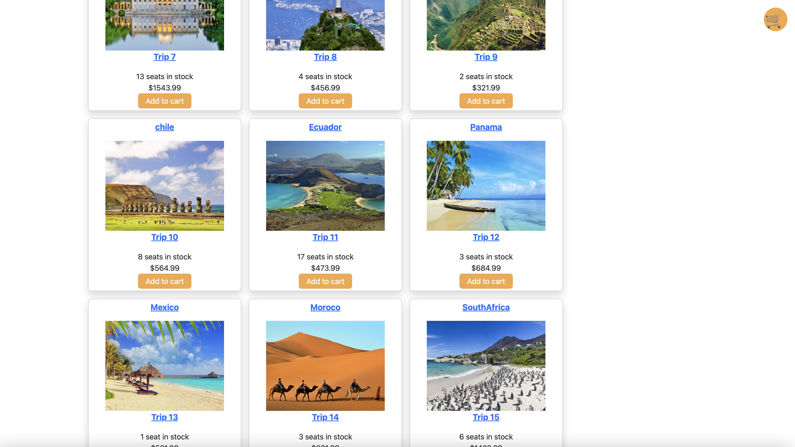
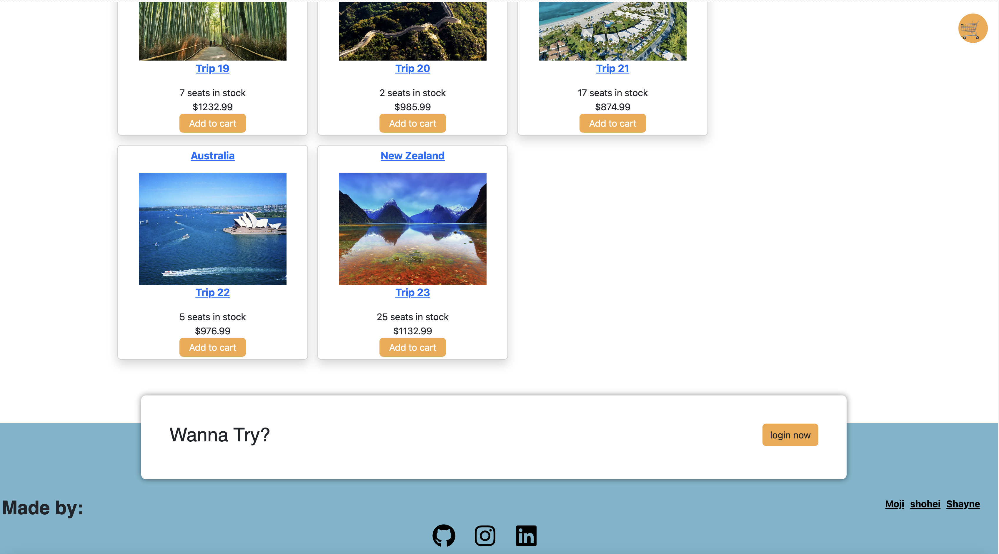
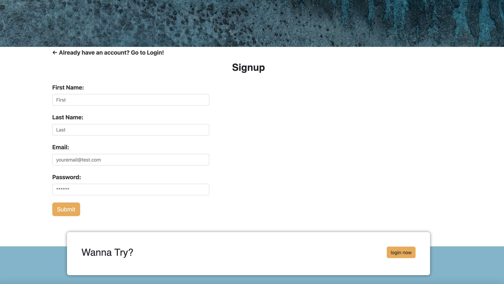
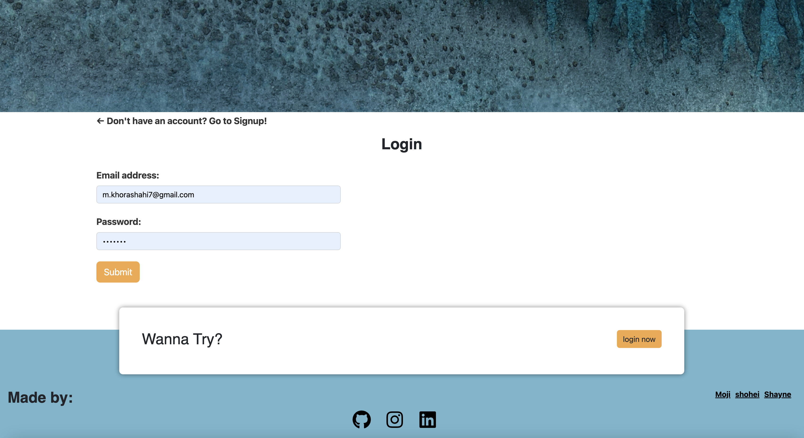
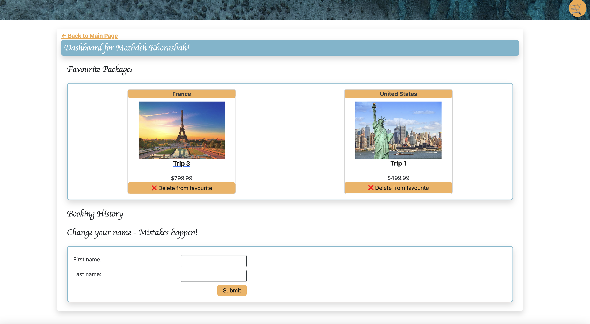
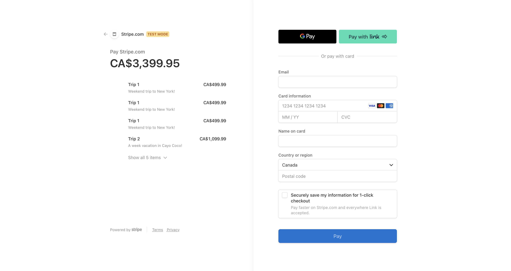

# GetAway

Members

Mozhdeh Khorashahi

Shohei Mochizuki

Shayne Whittle

## Description

Getaway is a travel agency that specializes in providing travel packages and tours to its clients. This website should provide a user-friendly and responsive interface, which will allow customers to easily browse and book their travel packages. Additionally, the website should include features such as personalized trip recommendations based on user preferences, a blog section to provide travel tips and inspiration, and integration with popular payment gateways for secure transactions.

## Table of Contents

[Installation](#installation)

[Usage](#usage)

[Credits](#credits)

[License](#license)

[Features](#features)

[How to Contribute](#how-to-contribute)

[Tests](#tests)

[Questions](#questions)

## Installation

Project repo:

https://github.com/shohei-mochizuki/getaway

Project deployed link:

https://getaway.herokuapp.com/

## Usage

the user can browse travel packages
and search and filter travel packages based on their preferences, such as destination, travel dates, and budget.

the user can selects a travel package
and view more details about the package, including the itinerary, accommodations, and inclusions.

the user decides to book a travel package and he/she
can proceed to the checkout page, where they can input their personal and payment information.

the user can completes the checkout process and
receives a confirmation email and the booking is recorded in their account.

when the user wants to see personalized trip recommendations
the website displays recommendations based on the user's preferences and search history.

the user clicks on a blog article
the user can read the article and view related content such as photos and more info(price duration etc).

when the user wants to login he/he can clicks on the login button and
the user is directed to the login/sign up page, where they can create an account or log in to an existing account.

if the user wants to see the dashboard he/she can logs in and clicks on the dashboard button and the user can view their account details, booking history, and the list of his/hers favorite packages.

Please see the screenshot of our website:

## Credits

To team members: shayne , Moji and shohei

Also the professors from Toronto Bootcamp

## License

MIT License

Copyright (c) 2023

Permission is hereby granted, free of charge, to any person obtaining a copy of this software and associated documentation files (the "Software"), to deal in the Software without restriction, including without limitation the rights to use, copy, modify, merge, publish, distribute, sublicense, and/or sell copies of the Software, and to permit persons to whom the Software is furnished to do so, subject to the following conditions:

The above copyright notice and this permission notice shall be included in all copies or substantial portions of the Software.

THE SOFTWARE IS PROVIDED "AS IS", WITHOUT WARRANTY OF ANY KIND, EXPRESS OR IMPLIED, INCLUDING BUT NOT LIMITED TO THE WARRANTIES OF MERCHANTABILITY, FITNESS FOR A PARTICULAR PURPOSE AND NONINFRINGEMENT. IN NO EVENT SHALL THE AUTHORS OR COPYRIGHT HOLDERS BE LIABLE FOR ANY CLAIM, DAMAGES OR OTHER LIABILITY, WHETHER IN AN ACTION OF CONTRACT, TORT OR OTHERWISE, ARISING FROM, OUT OF OR IN CONNECTION WITH THE SOFTWARE OR THE USE OR OTHER DEALINGS IN THE SOFTWARE.

## Features (Technologies)

HTML

CSS

Bootstrap

Javascript

Node

Express

GraphQL (Apollo)

MongoDB

React

JWT (Json Web Token)

Stripe

Bcrypt

## How to Contribute

N/A

## Tests

N/A

## Questions

If you have any questions you can reach us by our email address and our Github pages.

Github pages:

https://github.com/shohei-mochizuki

https://github.com/mojsun

https://github.com/shaynefw

email address:

shohei.mochizuki.jp@gmail.com

m.khorashahi7@gmail.com

shaynefw@gmail.com
